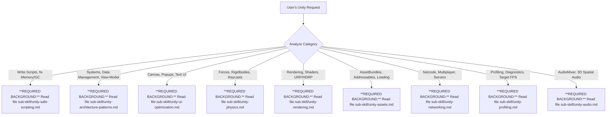

# Unity Master Skill Router

## Overview
This is the root coordinating skill for Unity. The AI is strictly prohibited from writing code or designing Unity systems without adhering to the strict standards defined in the specialized sub-skills below.

## Operating Environment & Trigger

Status: MANDATORY. 
**SUPREME DIRECTIVE**: Every Unity design, programming, testing, or refactoring process must 100% adhere to the **DevArchitechture** system's rules (strictly following Simplicity First, Surgical Changes). If you fail to comply, your code will be rejected. You must combine it with the Sub-Skills below.
When you receive a request related to creating Unity features, the first step is to identify the task's Category and load the corresponding **REQUIRED BACKGROUND**.

## Sub-Skills Routing

Scan the user's request, match it with the flowchart below, and you MUST READ THE FILE to load the data:

## Common Rationalizations

| Excuse / Rationalization | Reality Check |
|--------------------------|---------------|
| "This request is too small; I can write it directly without loading Sub-Skills." | Fatal errors like memory leaks or `GetComponent/Find` hide even in the smallest scripts. You MUST load the background. |
| "I already know how to optimize; I don't need to read the Physics/UI guide." | The Agent hasn't read this specific project's standards and will apply outdated boilerplate code. Discard code and read the Skill. |

**Any sign of these Red Flags: STOP, reject the code, and Load the Sub-Skill first.**
