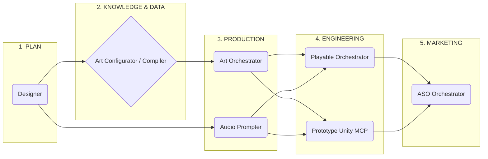

# 🎮 GAME PIPELINE: MASTER ARCHITECTURE
### Xây dựng Game Studio Tự động hóa với Multi-Agent AI
*Phát triển bởi Nhóm Google DeepMind*

---

# 🌟 TRIẾT LÝ THIẾT KẾ (DESIGN PHILOSOPHY)

Để tránh việc một AI nguyên khối (Monolithic AI) gánh quá nhiều việc và bị "ảo giác" (Hallucinations):

1. **Tự động hoá phân quyền (Phase-Gated):** AI làm việc cực đoan nhưng buộc phải chờ con người chốt hạ ở các mốc quan trọng (Ví dụ: Chốt vẽ phác thảo rồi mới được tô màu).
2. **Tính Nhất Quán qua RAG:** Định tuyến não AI bằng Vector khoảng cách. Nhân vật sinh ra luôn luôn chuẩn tỷ lệ và ánh sáng.
3. **Mẫu Mực Kỹ Thuật:** Game Playable nhồi Base64 < 3MB. Prototype Unity chạy mã C# trực tiếp bằng giao thức **MCP**.

---

# 🗺 BẢN ĐỒ CHUỖI CUNG ỨNG

---

# 🧠 PHASE 1: GAME DESIGNER (`game-designer`)

*Nhiệm vụ biến ý tưởng ngô nghê thành thiết kế tài liệu chặt chẽ.*

**Workflow 3 bước khắt khe:**
1. **Concept & Core Loop:** Bẻ ý tưởng thô ra Game loop cốt lõi.
2. **Rules Mapping:** Chỉ dựa vào bước 1 để trích luật game cứng (Damage, Tốc độ, Spawn rate...).
3. **Event Matrix & Export:** Biên dịch thành Ma trận sự kiện. Xuất file `[Project]_GDD.md` và băm nhỏ JSON thành 4 mảng tài sản.

---

# 🧬 PHASE 2: DATA & KNOWLEDGE RAG
*(`game-art-compiler` & `game-art-configurator`)*

*Máy móc không biết cái gì "đẹp". Chúng hiểu Vector khoảng cách.*

- **Compiler** gặt hái tất cả ảnh trong kho, dùng VLM (Vision Model) đọc hình khối rồi nhúng bằng thuật toán `sentence-transformers` vào không gian toán học (Embedding).
- Việc này tạo ra cái gọi là **DNA Thiết Kế**.
- Nếu có cấu hình mới, **Configurator** sẽ tự chống Conflict bằng *Cosine Similarity*. Kết quả: AI luôn nhớ phong cách game của bạn!

---

# 🎨 PHASE 3: SẢN XUẤT MỸ THUẬT (`game-art-orchestrator`)

*Nơi biến chữ thành hình dựa trên công nghệ **Few-Shot Visual Prompting** và **Human-In-The-Loop**.*

1. **RAG Inject:** Định vị phong cách. Khởi động AI bằng các ảnh mẫu mỏ neo (Archetypes). Bắt buộc chỉ vẽ Sketch và Nền Trắng Trong Suốt.
2. **Duyệt Sketch:** AI tạo bức sketch đen trắng, Trình lên màn hình chat. Con người "Duyệt".
3. **Final Polish:** Khi đã chốt mảng khối, AI lên màu chuẩn hệ RAG. Đưa VLM Evaluator ra đánh giá chéo. Trả file nạp vào Assets Catalog.

---

# 🎧 PHASE 3.5: KỸ SƯ ÂM THANH (`game-audio-prompter`)

*AI nghe không giống con người. Chúng cần dịch thuật kỹ thuật số.*

Theo sát GDD, `game-audio-prompter` bẻ khoá các luật lớn:
- **Luật Độ Vang (Reverb):** Tùy chỉnh mức độ Reverb theo mức độ sâu của Game.
- **Luật Chống Mỏi (Fatigue):** Âm thanh súng bắn 3 lần/giây -> Đặt cờ fast delay.
- **Luật Loop:** Đánh dấu mảng Seamless loop.
- **Kết quả:** Cẩm nang `Audio_Prompt_Book.md` chuẩn copy-paste cho Suno, Udio, ElevenLabs.

---

# 🧰 PHASE 4(A): PLAYABLE ADS (`game-playable-orchestrator`)

*Quảng cáo HTML5 < 3MB chạy mượt trên mọi Ad Networks.*

1. Khóa mục tiêu bằng **Budget Sentinel** (hạn chế bùng nổ dung lượng).
2. Xay nhuyễn ảnh và Audio thành định dạng **Base64** nguyên khối.
3. Sinh code game loop thuần vô `logic_hook.js`.
4. Ép bộ logic này vào template tĩnh lõi **Phaser 3**. Chặn đứng ảo giác Hallucination vì sườn Framework đã bị khoá cứng.

---

# 🕹️ PHASE 4(B): UNITY PROTOTYPE (`game-prototype-orchestrator`)

*Cơ chế cực kỳ nguy hiểm nhưng quyền lực: **Fire-and-Forget qua MCP**.*

Trị dự án Game lớn, Agent chiếm quyền thao túng Unity Editor:
1. **Verification:** Gắn **Placeholder Dummy** vào Engine cho các khối ảnh Art chưa vẽ xong định hình Physics.
2. **Task Generation:** Băm nhuyễn file GDD ra hàng chục `Task.MD` để chặn bệnh quẩn trí (Forgetfulness).
3. **Ghost Execution (MCP):** Mã hoá `Task.MD` đẩy qua đường dẫn ngõ MCP vào Unity. Sinh `.cs` scripts, kéo Inspector, Try-Catch tự sửa lỗi Domain Reload... Con người uốn trà nhìn AI tự ráp Game.

---

# 🚀 PHASE 5: APP STORE OPTIMIZATION (`game-aso-orchestrator`)

*Đưa Game lên Store một cách tự động chuẩn tỷ lệ.*

1. **Quét RAG Vibe:** Soi trend Store (Tối/sáng) qua Analyst Agent.
2. **Toàn Quyền Key Art:** Đưa AI vào khuôn **Template Bounding Box** ảo. Lên sketch bố cục, User chốt. Đánh bóng ảnh bìa chính (Icon / Feature Graphic).
3. **Batch Silently:** Một khi Icon xong, tự động chạy dưới nền Batch render 6 ảnh Screenshot còn lại. Tự động Auto-Resize, Crop theo tỷ lệ chuẩn App Store.

---

# 🏁 KẾT LUẬN & ĐỊNH HƯỚNG

**Thành tựu Mấu chốt:** Nén chặt giới hạn sáng tạo bằng các bộ Vector RAG kết hợp với Kiến trúc chặn luồng chia Task siêu vi. Giúp ý tưởng "Trạm tự ráp game AI" trở thành sự thật.

**Những rào cản cần chinh phục:**
- Rủi ro vượt Token Context cho Base64 khi game Playable phình to.
- Generative Audio chưa đủ kiểm soát vật lý để biến đổi toàn phần thành Local Vector.

Mở Terminal và gõ `@/game-designer` để khởi tạo phép thuật!
